# Render Box | 

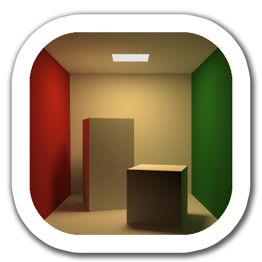 

### Introduction

The main goal of this project is to implement a path tracing 
algorithm in C# (without GPU optimization at first time).

There are also several different renders, such as the 
Mandelbrot Set or Perlin Noise.

Sources:

* https://en.wikipedia.org/wiki/Path_tracing (EN)

* https://ru.wikipedia.org/wiki/Трассировка_пути (RU)

### Requirements

* Visual Studio 2022
* .NET SDK 6.0
	
## Renderers

### PathRenderer

**Key features:**
* Point lingting
* Soft shadows
* Ambient occlusion
* Transparency & reflection
* Camera movement

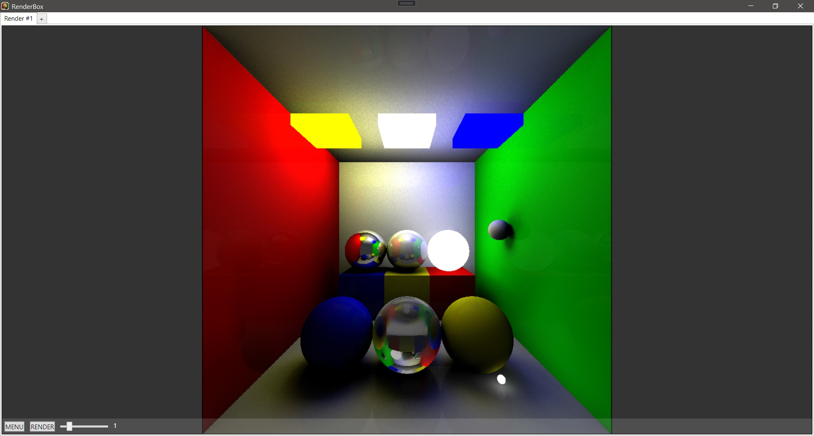
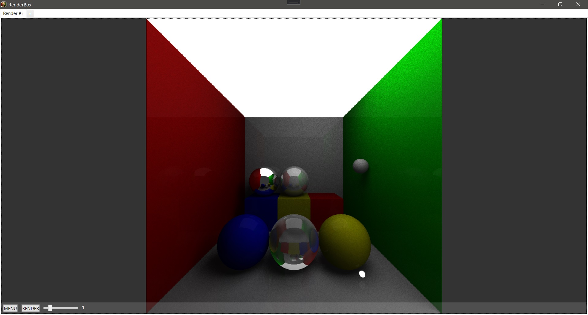
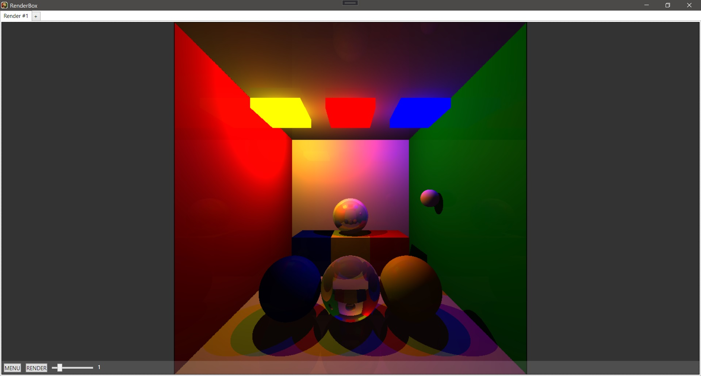
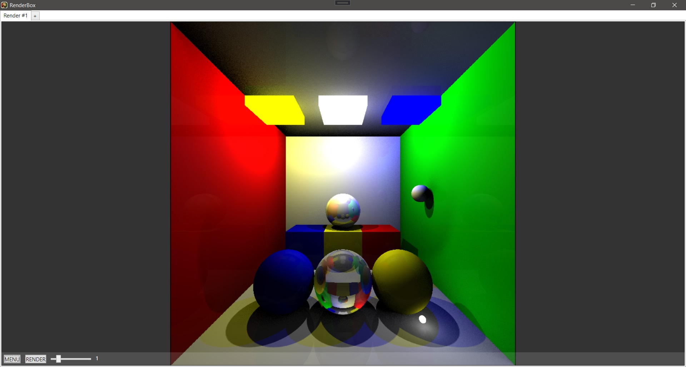

#### Making of

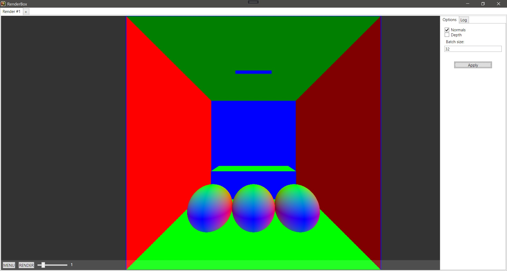
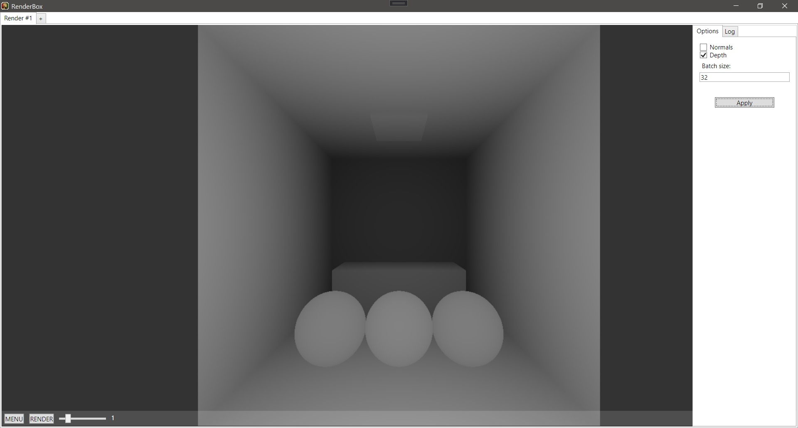
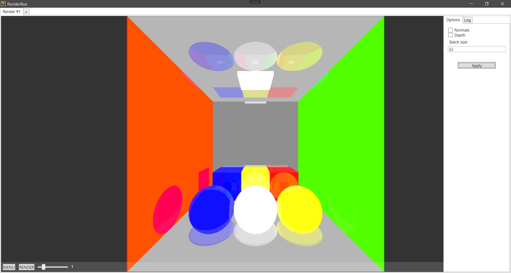
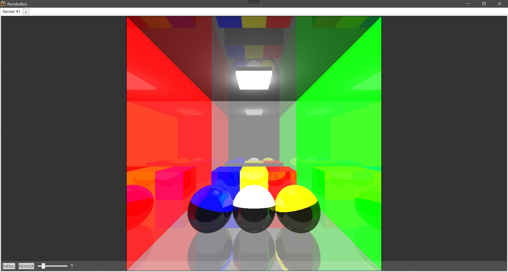
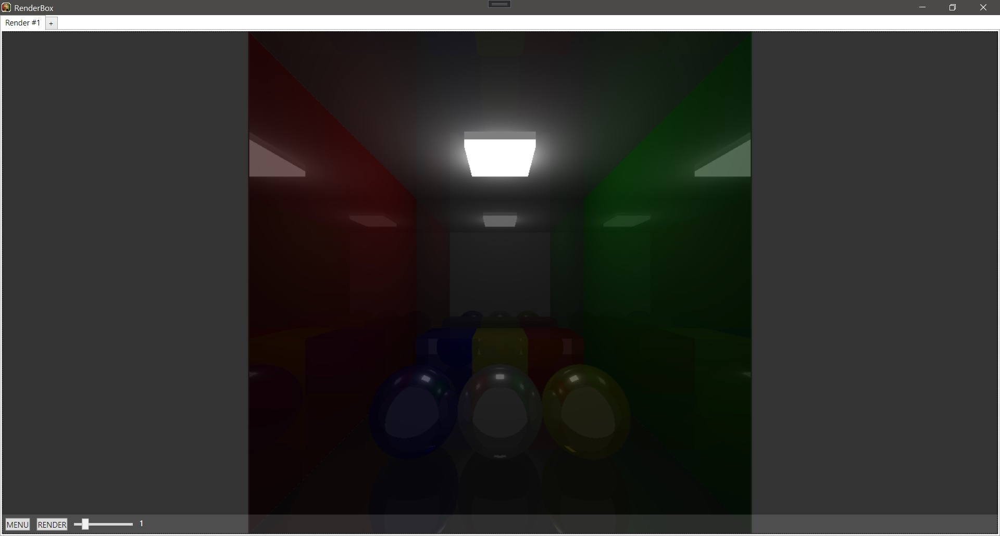
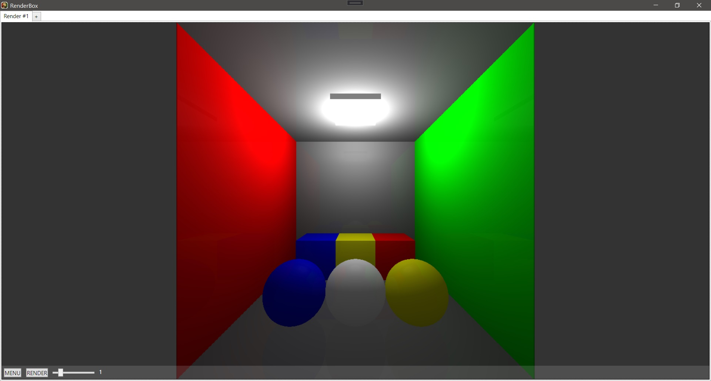
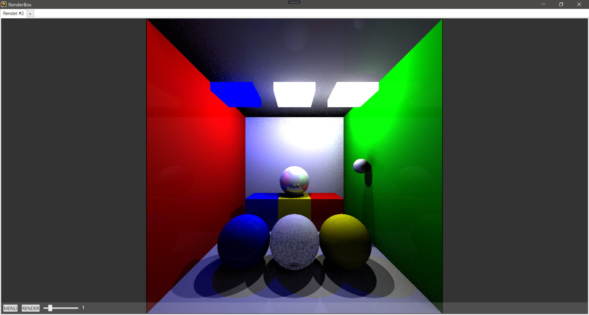
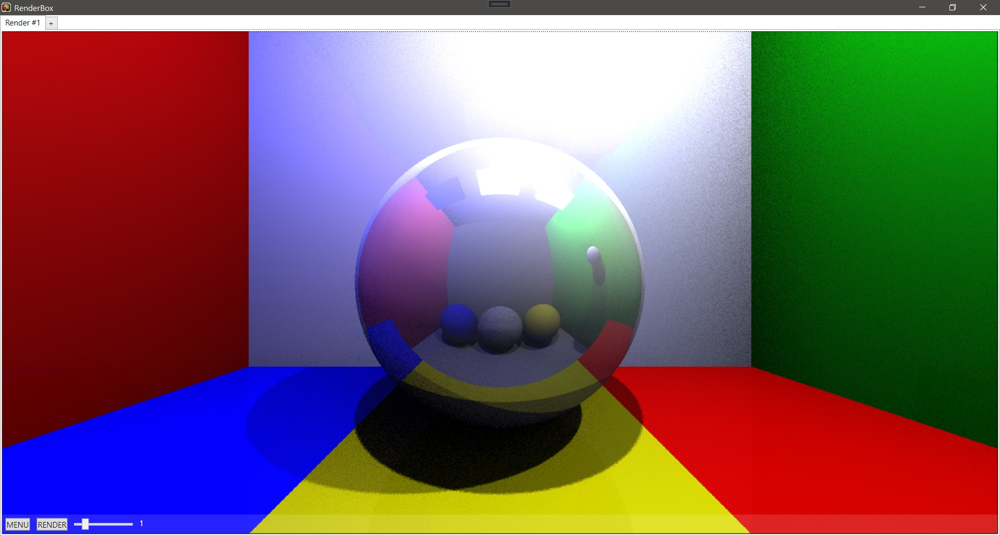

### MandelbrotRenderer

**Key features:**
* Zoom in / zoon out
* Color filters

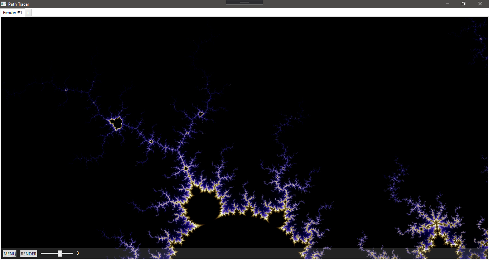

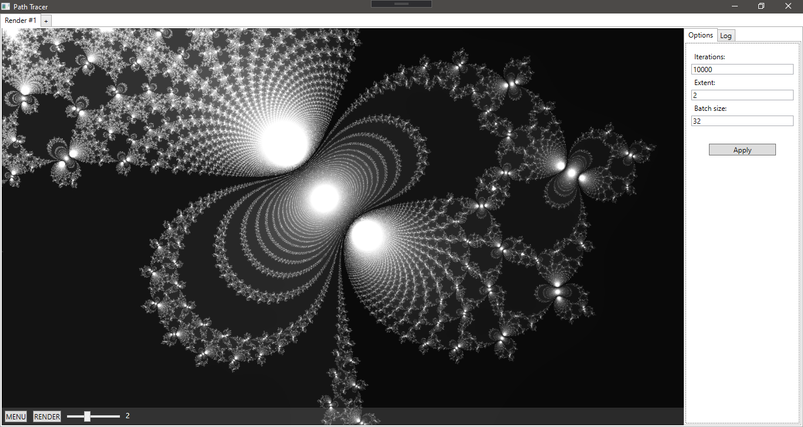

### PerlinRenderer

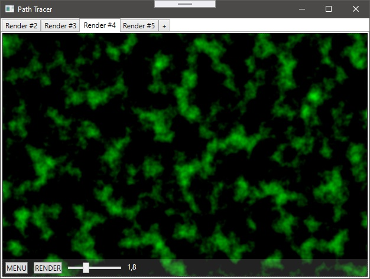

### RandomRenderer

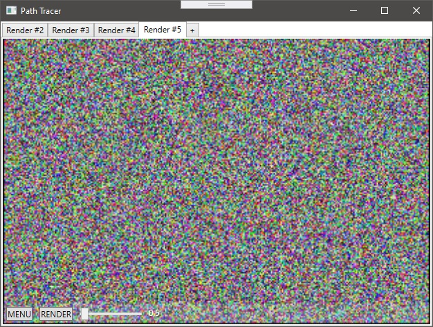

## Goal of project

